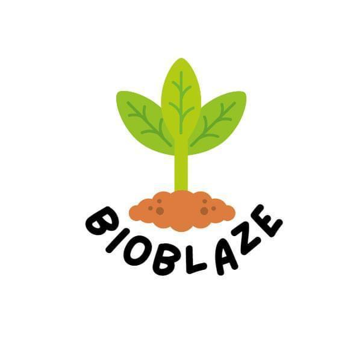
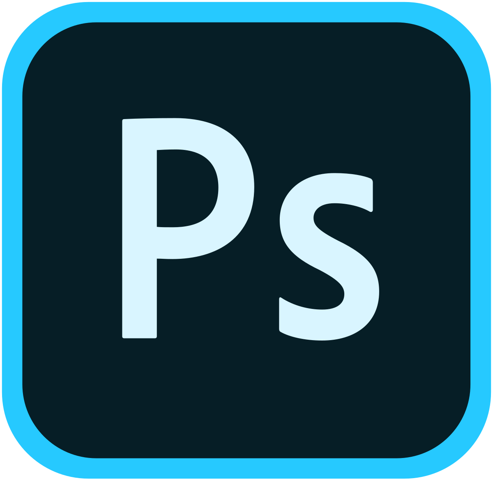

<h1 align="center">Team BioBlaze</h1>

 

 

 

 

## 💻 About

 

This repository contains our submission for the first 2023/2024 project - "Code Sprint - Green Challenges"!

 

## 🗂️ Used Technologies

 

### Used code editor & collaborative service:

 

 

### Used tools for our visual elements:

 

 

### Used tools for our site development:

 

 

### Used tools for our documentation, presentation & communication:

 

 

 

## 📄 Documents

### Presenting and Team Documentation

- [BioBlaze Documentation](docs/BioBLaze-documentation.docx)
- [BioBlaze Presentation](docs/BioBLaze-presentation.pptx)
 

 

## 🧒 Our Team

 

- <a href = "https://github.com/HPRusev22">Hristo Rusev</a> (SCRUM Trainer) 
- <a href = "https://github.com/MMDoychev22">Mitko Doychev </a> (Frontend Developer)
- <a href = "https://github.com/GSYanchev22">Gabriel Yanchev </a> (Frontend Developer)
- <a href = "https://github.com/DPHristov22">Daniel Hristov </a> (Designer)

 

 

<h1 align="center">Thanks for checking out our repo, show us some ❤️ by giving our repo a ⭐️!</h1>